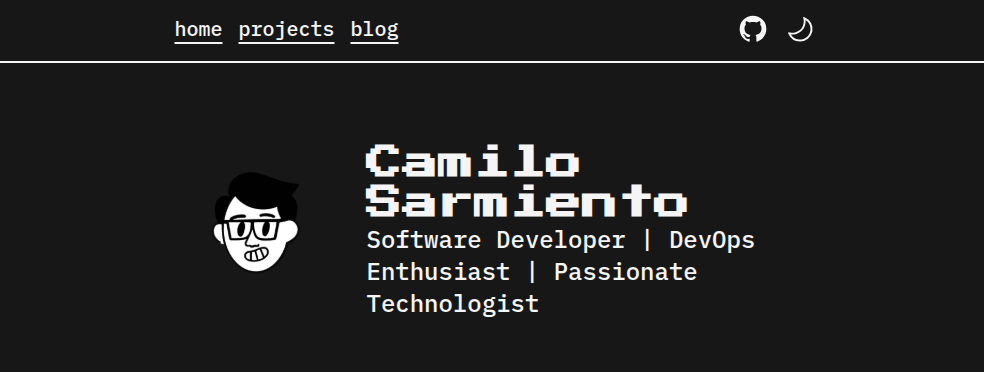

# 🌐 WEB PORTFOLIO



> Web Portfolio by **Camilo Sarmiento**, based on Astro template [Zaggonaut](https://github.com/RATIU5/zaggonaut) 🚀

## 🚀 Getting Started

[🔗 View the demo](https://camilosar.site) | [🗂 View the source code](https://github.com/Camilo-845/WebPortfolio)

Alternatively, you can create a new Astro project with Zaggonaut using:

```bash
# 🚀 pnpm
pnpm create astro@latest -- --template RATIU5/zaggonaut

# 🚀 pnpm (alternative)
pnpm create astro@latest --template RATIU5/zaggonaut

# 🚀 yarn
yarn create astro --template RATIU5/zaggonaut

# 🚀 bun
bun create astro@latest -- --template RATIU5/zaggonaut
```

---

## ✨ Features

✅ Dark & light mode  
✅ Customizable colors 🎨  
✅ 100 / 100 Lighthouse score ⚡  
✅ Fully accessible ♿  
✅ Fully responsive 📱  
✅ Type-safe 🛡️  
✅ SEO-friendly 🔍  

---

## 🎨 Customization

The theme is set up to be easy to customize.

### 🎨 Colors

You can customize the theme colors by editing `src/styles/global.css`.  
This file uses **Tailwind CSS** and **CSS variables** to define colors:

```css
:root {
  --color-zag-dark: #1a1a1a;
  --color-zag-light: #ffffff;
  --color-zag-dark-muted: rgba(26, 26, 26, 0.8);
  --color-zag-light-muted: rgba(255, 255, 255, 0.8);
  --color-zag-accent-light: #ff9800;
  --color-zag-accent-light-muted: rgba(255, 152, 0, 0.8);
  --color-zag-accent-dark: #ff5722;
  --color-zag-accent-dark-muted: rgba(255, 87, 34, 0.8);
}
```

### 🏝️ Text

Customize the text content by editing `src/lib/variables.ts`.  
For example, to set your username:

```typescript
export const GLOBAL = {
  // Site metadata
  username: "camilosar-123",

  // Profile image
  profileImage: "profile.webp",

  // Menu items
  menu: {
    home: "/",
    projects: "/projects",
    blog: "/blog",
  }
};
```

---

## 🛠️ Skills and Icons

You can customize your **skills icons** by adding `.svg` files to the **`src/icons`** folder.

In `variables.ts`, specify the SVG filename like this:

```typescript
export const GLOBAL = {
  // 🏆 Skills content
  skills: [
    { name: "HTML", icon: "html_icon" },
  ],
};
```

**If you don't provide an `icon`, no problem!** A default icon will be used.  

> [!CAUTION]
> If you are running the project while changing icons, you may encounter issues.  
> **Restart the run command** to see your changes. 🔄  

## 🔄 Sync Projects, Blog Content, and Images with an Obsidian Vault

You can synchronize your **Obsidian Vault** with your Astro project to keep your **projects**, **blog** content, and **images** up to date.

The sync scripts are located in `utils/ObsidianSync/` and `utils/ImagesSync/`:

- **Linux/macOS**: `sync.sh`
- **Windows**: `sync.ps1`

### ⚙️ Configuration

Before running the script, you need to update the **source** and **destination** paths in the respective script.

#### 🐧 Linux/macOS (`sync.sh`)

Open `utils/ObsidianSync/sync.sh` and update these variables:

```bash
# Change these paths to match your setup
sourcePathProjects="$HOME/Documents/ObsidianVault/Portfolio/projects"
destinationPathProjects="$(cd \"$(dirname \"${BASH_SOURCE[0]}\")\" && pwd)/../../src/pages/projects"

sourcePathBlog="$HOME/Documents/ObsidianVault/Portfolio/blog"
destinationPathBlog="$(cd \"$(dirname \"${BASH_SOURCE[0]}\")\" && pwd)/../../src/pages/blog"
```

#### 🖥 Windows (`sync.ps1`)

Open `utils/ObsidianSync/sync.ps1` and update these variables:

```powershell
# Change these paths to match your setup
$sourceProjects = "$env:USERPROFILE\Documents\ObsidianVault\Portfolio\projects"
$destinationProjects = "$PSScriptRoot\..\..\src\pages\projects"

$sourceBlog = "$env:USERPROFILE\Documents\ObsidianVault\Portfolio\blog"
$destinationBlog = "$PSScriptRoot\..\..\src\pages\blog"
```

### 📂 Configuring the Python Image Sync Script

In `utils/ImagesSync/sync.py`, you need to specify the location of your Obsidian Vault.

Open `sync.py` and update the `attachments_dir` variable to match your Obsidian Vault's directory:

```python
# Paths
attachments_dir = "/home/YOUR_USER/Documents/Obsidian Vault/00 - Portfolio/images"  # Update this path
posts_dir = os.path.join(script_dir, "../../src/pages/blog/")
static_images_dir = os.path.join(script_dir, "../../images/")
```

Replace `/home/YOUR_USER/Documents/Obsidian Vault/00 - Portfolio/images` with the actual path of your Obsidian Vault directory.

### 🚀 Running the Sync Script

The script supports two synchronization modes:

- **Push** (default): Syncs content **from** Obsidian **to** your Astro project.
- **Pull**: Syncs content **from** your Astro project **to** Obsidian.

#### **Linux/macOS**

Run the script from the project root:

```bash
bash utils/ObsidianSync/sync.sh push  # Default mode
bash utils/ObsidianSync/sync.sh pull  # Sync in reverse
```

#### **Windows**

Run the script in PowerShell:

```powershell
powershell -ExecutionPolicy Bypass -File utils/ObsidianSync/sync.ps1 -Mode push  # Default mode
powershell -ExecutionPolicy Bypass -File utils/ObsidianSync/sync.ps1 -Mode pull  # Sync in reverse
```

### 🔄 Full Sync (Obsidian + Images)

To fully synchronize your Obsidian content and images, run the global sync script:

#### Linux/macOS

```bash
bash utils/sync.sh push  # Default mode
bash utils/sync.sh pull  # Sync in reverse
```

#### Windows

```powershell
powershell -ExecutionPolicy Bypass -File utils/sync.ps1 -Mode push  # Default mode
powershell -ExecutionPolicy Bypass -File utils/sync.ps1 -Mode pull  # Sync in reverse
```

This will execute:

1. `ObsidianSync/sync.sh` or `sync.ps1` (depending on the OS) to sync projects and blog content.
2. `ImagesSync/sync.py` to update images used in the Markdown files, converting them to WebP when Pillow is installed.

### 🖼 Image Conversion to WebP

The image sync script (`utils/ImagesSync/sync.py`) processes images referenced in Markdown files and ensures they are saved in WebP format to optimize loading speed. If the required `Pillow` package is not installed, the script will fall back to using PNG format.

#### Installing Pillow

To enable WebP conversion, install Pillow:

```bash
pip install pillow
```

#### ✅ Notes

- Ensure the scripts have execution permissions (`chmod +x sync.sh` for Linux/macOS).
- If PowerShell restricts execution, you may need to run:

  ```powershell
  Set-ExecutionPolicy Unrestricted -Scope Process
  ```
