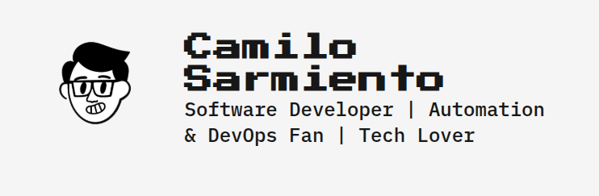

# WEB PORTFOLIO



Web Portfolio by Camilo Sarmiento, based on Astro template [Zaggonaut](https://github.com/RATIU5/zaggonaut)

## Getting Started

[View the demo](https://camilosar.site) or [view the source code](https://github.com/RATIU5/zaggonaut).

Alternatively, you can create a new Astro project with Zaggonaut like this:

```bash
# pnpm
pnpm create astro@latest -- --template RATIU5/zaggonaut

# pnpm
pnpm create astro@latest --template RATIU5/zaggonaut

# yarn
yarn create astro --template RATIU5/zaggonaut

# bun
bun create astro@latest -- --template RATIU5/zaggonaut
```

## Features

- Dark & light mode
- Customizable colors
- 100 / 100 Lighthouse score
- Fully accessible
- Fully responsive
- Type-safe
- SEO-friendly

## Customization

The theme is setup a specific way to make it easy to customize.

### Colors

You can customize the colors of the theme by editing the `src/styles/global.css` file.
This file uses Tailwind CSS and CSS variables to customize the colors of the theme.
Zaggonaut uses the following CSS variables:

- `--color-zag-dark`: The dark color of the theme
- `--color-zag-light`: The light color of the theme
- `--color-zag-dark-muted`: The dark color of the theme with a slight opacity
- `--color-zag-light-muted`: The light color of the theme with a slight opacity
- `--color-zag-accent-light`: The light accent color of the theme
- `--color-zag-accent-light-muted`: The light accent color of the theme with a slight opacity
- `--color-zag-accent-dark`: The dark accent color of the theme
- `--color-zag-accent-dark-muted`: The dark accent color of the theme with a slight opacity

### Text

You can customize the text of the theme by editing the `src/lib/variables.ts` file.
This file contains all of the text used throughout the theme.

For example, you can change the `username` variable to your own username and everywhere the username is used will be replaced with your username.

```typescript
export const GLOBAL = {
  // Site metadata
  username: "camilosar-123",

  // ...

  // Profile image
  profileImage: "profile.webp",

  // Menu items
  menu: {
    home: "/",
    projects: "/projects",
    blog: "/blog",
  }
};
```

### Skills and Icons

You can customize your skill icons by adding `.svg` files to the `src/icons` folder

In your `variables.ts` file, you need to specify the SVG filename like this:

```typescript
export const GLOBAL = {
  // Skills content
  skills: [
    { name: "HTML", icon: "html_icon" },
  ],
};
```

> [!CAUTION]
> If you are running the project while changing the icons, you may encounter issues. Restart the run command to see your changes
